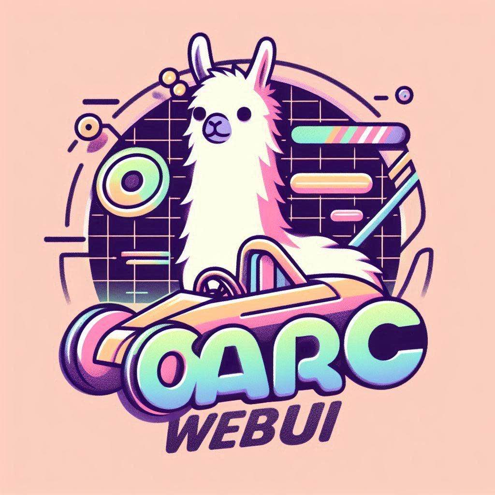
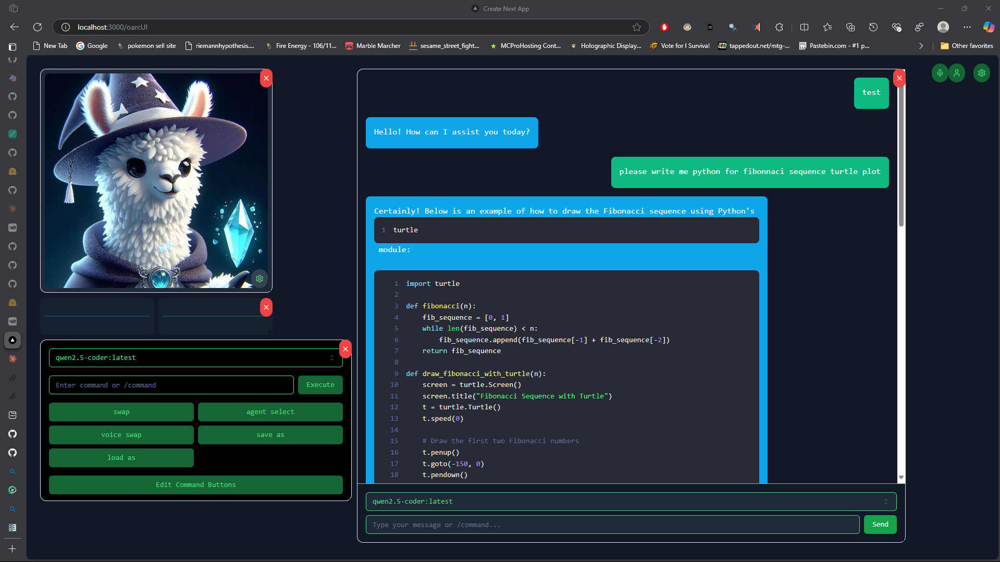

<p align="center">
  
</p>
<p align="center">
  <a href="https://ko-fi.com/theborch"></a>
  <a href="https://discord.gg/mNeQZzBHuW"></a>
</p>

# 🌐 OARC-WebUI 🖥️ V0.1.0
***[🦙 Ollama Discord Server 🦙](https://discord.gg/ollama)*** | ***[OARC Webui Demo](https://vimeo.com/1022776731?share=copy)***

## About
**OARC-WebUI** is a modern web interface for the Ollama Agent Roll Cage (OARC) framework, built with Next.js 14 and shadcn/ui. It provides a sleek, responsive frontend for interacting with OARC's powerful local AI capabilities including chat, speech-to-text, text-to-speech, and vision features.

<p align="center">
  
</p>

## Features
- 🎨 Modern, responsive UI built with Next.js 14 and shadcn/ui
- 💬 Real-time chat interface with streaming responses
- 🎙️ Integrated speech recognition and text-to-speech
- 👁️ Vision model integration with LLaVA
- 📊 Customizable dashboard with draggable components
- 🎭 Avatar visualization with lip sync support (not ready)
- 🌗 Dark/Light theme switching
- ⚡ WebSocket-based real-time communication

## Prerequisites
- Node.js 18+
- OARC Python API Server running locally
- Ollama installed with desired models

## Quick Start
1. Step one, install [ollama_agent_roll_cage](https://github.com/Leoleojames1/ollama_agent_roll_cage)

2. Step two, bring the roll cage to life with oarc-webui
```bash
# Clone the repository
git clone https://github.com/Leoleojames1/oarc-webui.git

# Install dependencies
cd oarc-webui
npm install

# Start the development server
npm run dev
